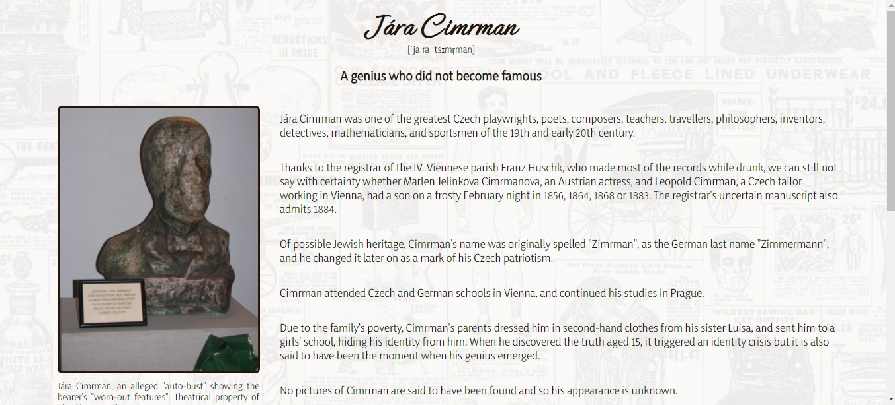
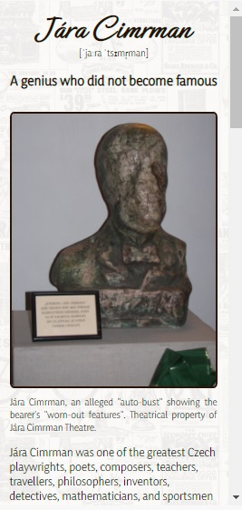

### freeCodeCamp > Responsive Web Design Projects

# Build a Tribute Page

This is a solution to the freeCodeCamp's [Build a Tribute Page](https://www.freecodecamp.org/learn/responsive-web-design/responsive-web-design-projects/build-a-tribute-page) project. Projects are ment to apply all of the skills, principles, and concepts learned so far: HTML, CSS, Visual Design, Accessibility, and more.

## Table of contents

- [Overview](#overview)
  - [The challenge](#the-challenge)
  - [Screenshot](#screenshot)
  - [Links](#links)
- [My process](#my-process)
  - [Built with](#built-with)
  - [What I learned](#what-i-learned)
- [Author](#author)
- [Acknowledgments](#acknowledgments)

## Overview

### The challenge
- Users complete 9 User Stories to pass the test
- Users can use HTML, JavaScript, and CSS to complete this project
- Plain CSS is recommended

### Screenshot

Desktop layout


Mobile layout


### Links

- Solution URL: https://github.com/PavlinaPs/Project1-Tribute
- Live Site URL: https://pavlinaps.github.io/Project1-Tribute/

## My process

### Built with

- Semantic HTML5 markup
- CSS Grid areas
- Flexbox

### What I learned

This is my first project ever. 

I am proud of using grid areas:

```css
.grid-container {
    display: grid;
    grid-template-areas: 
        "item1 item2";
    }
```
Grid areas helped me to re-arange the layout for mobile devices:

```css
@media (max-width: 700px) {
    .grid-container {
      grid-template-areas: 
      "item1"
      "item2";
    }
```

## Author

- GitHub - [PavlinaPs](https://github.com/PavlinaPs)
- Frontend Mentor - [@PavlinaPs](https://www.frontendmentor.io/profile/PavlinaPs)

## Acknowledgments

I would like to say a big Thank You to freeCodeCamp for everyting they do and for all I have already learned from them.
